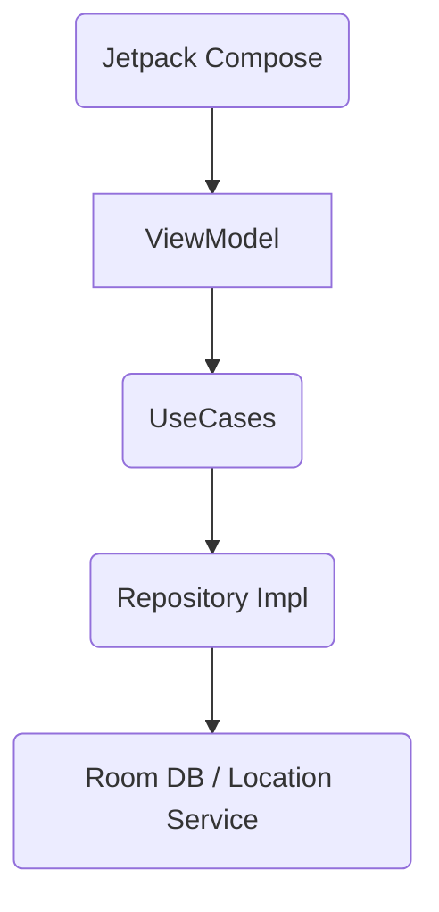

<p align="center">
  
</p>

<h1 align="center">TARGET PING</h1>
<p align="center">
  <strong>Tactical Location Intelligence & Surveillance System</strong>
</p>

<p align="center">
  <a href="https://kotlinlang.org/"></a>
  <a href="https://developer.android.com/jetpack/compose"></a>
  <a href="https://developer.android.com/training/dependency-injection/hilt-android"></a>
  <a href="https://developer.android.com/topic/architecture"></a>
</p>

<p align="center">
  
  
  
  
</p>

---

## 🛰️ Mission & Overview

**Target Ping** is not just another GPS alarm; it is a **military-grade, precision tracking utility** engineered for Android. It enables users to define tactical perimeters (Geo-Fences) and receive high-priority alerts upon entry.

Unlike standard apps that rely on the unreliable Android Geofencing API, Target Ping utilizes a custom **Foreground Service Architecture** to ensure **100% reliability** in background operations, bypassing aggressive OEM battery optimizations.

> *"Precision is not an option, it is the standard."*

---

## 📱 Tactical UI / UX Showcase

The application features a **"Cyber Tactical"** design language, utilizing **Glassmorphism**, **Neon Accents**, and **Edge-to-Edge** transparency.

| **Command Center (Map)** | **Surveillance List** | **Target Acquisition** |
|:---:|:---:|:---:|
|  |  |  |
| *Real-time Radar Pulse & HUD* | *Lite-Mode Map Snapshots* | *Precision Crosshair Targeting* |

---

## ⚡ Key Features

### 🟢 Real-Time Background Intelligence
* **Persistent Tracking:** Runs invisibly in the background using a **Foreground Service** with a persistent notification.
* **Dead-Reckoning:** Continues to monitor location even when the app is killed from the recent apps list.

### 🎯 Precision Targeting
* **Crosshair Logic:** Instead of dragging a pin, the map moves under a fixed crosshair for maximum accuracy.
* **Live Radius:** Visual feedback changes instantly as you adjust the perimeter radius (e.g., 50m, 500m).

### 🛡️ Privacy & Security
* **Offline First:** All data is encrypted and stored locally using **Room Database**. No cloud uploads.
* **Transparent:** The persistent notification ensures the user always knows when tracking is active.

### 💎 Premium Experience
* **Auto-Location:** Automatically zooms to the user's location on startup.
* **Smart HUD:** Heads-Up Display showing GPS status and system arming state.
* **Battery Optimized:** Uses adaptive intervals for `FusedLocationProvider` to save power.

---

## 🛠️ Technical Architecture (The Engine)

This project strictly follows **Clean Architecture** principles, separating concerns into three distinct layers.



### 🏗️ Tech Stack

| Category | Technology / Library | Description |
| --- | --- | --- |
| **Language** | **Kotlin** | 100% Native implementation. |
| **UI** | **Jetpack Compose** | Modern declarative UI toolkit (Material 3). |
| **DI** | **Hilt (Dagger)** | Dependency Injection for modularity. |
| **Async** | **Coroutines & Flow** | Managing background threads and reactive streams. |
| **Data** | **Room Database** | Type-safe local SQLite persistence. |
| **Nav** | **Navigation Compose** | Type-Safe navigation with **Kotlin Serialization**. |
| **Maps** | **Maps SDK for Android** | Google Maps implementation with `maps-compose`. |
| **Background** | **Foreground Service** | For persistent location monitoring. |
| **Permissions** | **Accompanist** | Handling runtime permissions gracefully. |

---

## 📂 Project Structure

The codebase is organized by **Features**, making it scalable for large teams.

```text
com.vahitkeskin.targetping
├── data                 # Data Layer (Network, DB, Service)
│   ├── local            # Room Database & DAO
│   ├── repository       # Repository Implementations
│   └── service          # LocationTrackingService (The Core)
├── domain               # Domain Layer (Pure Kotlin)
│   ├── model            # Data Classes
│   ├── repository       # Repository Interfaces
│   └── usecase          # Business Logic (Proximity Calculations)
├── di                   # Hilt Dependency Injection Modules
└── ui                   # Presentation Layer
    ├── components       # Reusable UI (Radar, GlassCards)
    ├── navigation       # NavGraph & Type-Safe Routes
    ├── features
    │   ├── map          # Main Dashboard Logic
    │   ├── list         # Target Management
    │   └── add_edit     # Target Creation Logic
    └── theme            # Custom Design System

```

---

## 🧩 Under The Hood: How Tracking Works?

Target Ping does not rely on the OS's `GeofenceClient`, which often fails due to network or battery restrictions. Instead, it uses a manual calculation engine:

1. **Service Start:** When the user taps "Play", `LocationTrackingService` starts as a **Foreground Service**.
2. **GPS Lock:** It subscribes to `FusedLocationProviderClient` with `PRIORITY_HIGH_ACCURACY`.
3. **Math Engine:** On every location update, the app calculates the **Haversine Distance** between the user and all active targets in the database.
4. **Trigger:** If `Distance < Radius`, a high-priority notification is fired immediately.

---

## ⚙️ Installation & Setup

1. **Clone the Repository**
```bash
git clone [https://github.com/vahitkeskin/TargetPing.git](https://github.com/vahitkeskin/TargetPing.git)

```


2. **Configure API Key**
* Go to Google Cloud Console.
* Enable **Maps SDK for Android**.
* Add your API key to `local.properties`:
```properties
MAPS_API_KEY=AIzaSyD...

```


3. **Build & Run**
* Open in Android Studio (Iguana+).
* Sync Gradle.
* Run on a physical device for best GPS results.


---

## 🔒 Permissions Used

* `ACCESS_FINE_LOCATION`: For precise target detection.
* `ACCESS_COARSE_LOCATION`: Fallback location.
* `POST_NOTIFICATIONS`: For the persistent service foreground notification.
* `FOREGROUND_SERVICE`: To keep the app alive in the background.

---

## 👨‍💻 Author

<p align="left">
<strong>Vahit Keskin</strong>


<em>Senior Android Developer & Architect</em>
</p>

* 🚀 Specialized in Kotlin & Jetpack Compose.
* 🏗️ Focus on Clean Architecture & Scalable Systems.
* 🎨 Passionate about Pixel-Perfect UI.

---

## ⚖️ License & Copyright

**Copyright © 2026 Vahit Keskin. All Rights Reserved.**

This project is open-source for **educational and portfolio demonstration purposes**.

You are encouraged to:
* 👀 **Review** the code architecture and patterns.
* 🍴 **Fork** the repository for personal study.
* 🔧 **Experiment** with the source code.

**However, commercial use, redistribution, or publishing this application (or a substantially similar derivative) to the Google Play Store is strictly prohibited without prior written permission.**

For commercial inquiries or licensing, please contact the author.